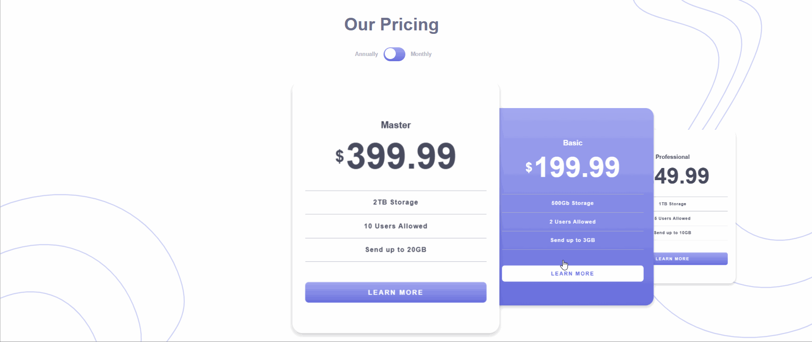

# 💰 Pricing Component with Toggle

This is a **pricing component** built with **React** and enhanced with **Swiper.js** to add slider functionality for better mobile interaction. The component is inspired by the [Frontend Mentor](https://www.frontendmentor.io/) "Pricing Component with Toggle" challenge. Users can switch between monthly and yearly billing, and the layout adapts beautifully across all devices.

## 🔗 Live Demo

👉 [View Live on GitHub Pages](https://anastasiiiii.github.io/pricing-component-with-toggle/)

## 🎥 Demo GIF



## 🎯 Challenge

Build a responsive pricing component with a toggle switch that allows users to choose between monthly and yearly billing plans. Add interactive behavior and use a clean, accessible design.

## ⚙️ Technologies Used

- React  
- Swiper.js (for responsive pricing cards slider)  
- JavaScript (ES6+)  
- CSS3  
- GitHub Pages (for deployment)

## 💡 Features

- Toggle switch between **Monthly** and **Yearly** pricing  
- Pricing cards in a **Swiper** carousel (especially useful on mobile)  
- Responsive design for all screen sizes  
- Clean and modern UI using modular React components  
- Smooth transitions and animations

## 🚀 Getting Started Locally

1. **Clone the repository:**
   ```bash
   git clone https://github.com/yourusername/your-repo-name.git
   cd your-repo-name
   
2. **Install dependencies:**
    ```bash
    npm install
    npm install swiper
    
4. **Start the development server:**
   ```bash
   npm start

6. **View in browser:** http://localhost:3000

## 🛠️ Future Improvements

- Add pricing plan features list per card
- Animate toggle switch
- Add theme switcher (light/dark mode)
- Save billing choice in localStorage

## 🙌 Acknowledgements
- Challenge and design by Frontend Mentor
- Carousel powered by Swiper.js
